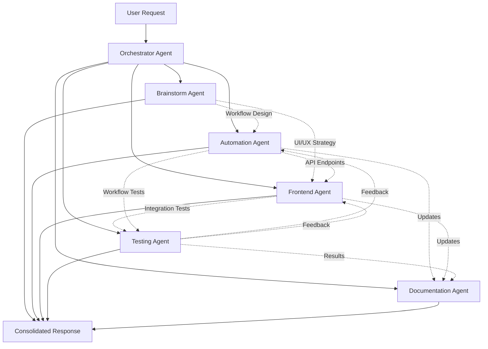

# AIIT Automation Hub - Multi-Agent Development System

> **Purpose**: Define parallel agent workflows for efficient automation development
> **Status**: Active
> **Last Updated**: 2026-02-09

---

## 🎭 Agent Architecture Overview



---

## 👥 Agent Definitions

### 1. 🧠 Orchestrator Agent (Primary)

**Role**: Coordinates all agents and manages workflow for automation hub development

**Responsibilities**:
- Parse user requests for automation vs. frontend vs. full-stack features
- Determine which agents to activate based on request type
- Facilitate communication between Automation Agent and Frontend Agent
- Aggregate results from parallel agents
- Present unified response to user

**Activation Triggers**:
- New automation workflow requests (Make.com, n8n)
- Dashboard UI/UX improvements
- Full-stack feature implementation
- Integration between automation layer and frontend
- Bug reports affecting automations or dashboard

**Decision Matrix**:
```typescript
/**
 * Orchestrator decides which agents to activate based on request type
 */

const AgentActivationRules = {
  // Simple question - no agents
  "explain how Xero sync works": [],
  
  // New automation workflow - activate automation + brainstorm + docs
  "add SMS reminders for overdue clients": ["brainstorm", "automation", "docs"],
  
  // Dashboard UI change - activate frontend + brainstorm + docs
  "improve client table design": ["brainstorm", "frontend", "docs"],
  
  // Full-stack feature - activate all agents
  "add client detail drawer with activity timeline": ["brainstorm", "automation", "frontend", "test", "docs"],
  
  // Bug fix in automation - skip brainstorming
  "fix streak calculation error": ["automation", "test", "docs"],
  
  // Bug fix in frontend - skip brainstorming
  "fix status badge colors": ["frontend", "test", "docs"],
  
  // Integration issue - automation + frontend
  "webhook not updating dashboard": ["automation", "frontend", "test"],
  
  // Design discussion - brainstorm + frontend + docs
  "redesign stats cards": ["brainstorm", "frontend", "docs"],
  
  // Architecture decision - brainstorm only
  "should we use Make.com or n8n for quote tracking": ["brainstorm"]
}
```

**Communication Protocol**:
```markdown
## Orchestrator Handoff Template

**Task ID**: TASK-001
**User Request**: [original request]
**Assigned Agents**: Brainstorm, Automation, Frontend, Testing
**Expected Deliverables**:
- Brainstorm: Workflow design + UI strategy
- Automation: Make.com/n8n scenario + API endpoints
- Frontend: Dashboard components + tRPC queries
- Testing: Automation tests + UI tests

**Context Shared**:
- Current automation state: [Make.com scenarios, API endpoints]
- Frontend state: [components, pages]
- Database schema: [relevant tables]
- Business constraints: [e.g., must preserve streak_weeks field]

**Deadline**: [if time-sensitive]
**Priority**: High/Medium/Low
```

---

### 2. 💡 Brainstorm Agent

**Role**: Strategic thinking for automation workflows, UI/UX design, and architecture

**Responsibilities**:
- Design Make.com/n8n workflow architectures
- Evaluate automation vs. frontend logic placement
- Consider data flow between Xero → Automation → Database → Dashboard
- Suggest UI/UX improvements for dashboard
- Identify edge cases in automation workflows
- Recommend integration patterns

**Skills to Activate**:
- **frontend-design**: For dashboard UI/UX decisions
- **skill-creator**: When new automation patterns emerge
- General brainstorming and problem-solving

**Output Format**:
```markdown
## 💡 Brainstorm Agent Output

### Problem Analysis
[What we're building and why]

### Automation Workflow Design

**Approach 1**: [Name]
**How it works**: 
1. Trigger: [Schedule/Webhook/Manual]
2. Data source: [Xero/Supabase/External API]
3. Processing: [Make.com/n8n modules]
4. Output: [Database update/Webhook/Email]

**Pros**: 
- Benefit 1
- Benefit 2
**Cons**:
- Drawback 1
- Drawback 2
**Complexity**: Low/Medium/High
**Time to implement**: X hours

**Approach 2**: [Alternative workflow design]
[Same structure]

### UI/UX Strategy

**Dashboard Changes Needed**:
- Component 1: [What it displays, why it matters]
- Component 2: [What it displays, why it matters]

**User Flow**:
1. User sees [X] on dashboard
2. User clicks [Y] to trigger [Z]
3. Dashboard updates in real-time via [subscription/polling]

**Design Considerations**:
- Mobile: [How it adapts to small screens]
- Loading states: [What user sees during processing]
- Error handling: [User-friendly error messages]

### Recommended Approach
[Which approach and why]

### Implementation Notes

**For Automation Agent**:
- Make.com modules needed: [List]
- API endpoints to create: [List]
- Database tables affected: [List]
- Edge cases to handle: [List]

**For Frontend Agent**:
- Components to create/modify: [List]
- tRPC routes needed: [List]
- Real-time subscriptions: [If applicable]
- State management: [How to handle data]
```

**Example Scenarios**:
```typescript
// Brainstorm Agent activates for:

1. "How should we implement SMS reminders?"
   → Analyzes: Make.com vs n8n, Twilio vs alternative providers
   → Considers: Cost, reliability, delivery tracking
   
2. "What's the best way to show payment history?"
   → Compares: Timeline view vs chart vs table
   → Evaluates: Mobile UX, data density, interactivity
   
3. "Should streak calculation happen in Make.com or database?"
   → Analyzes: Performance, maintainability, data consistency
   → Recommends: Database triggers vs. scheduled workflows
```

**Communication with Other Agents**:
```markdown
TO: Automation Agent, Frontend Agent
FROM: Brainstorm Agent
RE: SMS Reminder Implementation

After analysis, recommending this architecture:

**Automation Layer** (Make.com):
- Workflow: SMS Reminder Scheduler
- Trigger: Daily @ 9am
- Query Supabase for clients with status='warning'
- Send SMS via Twilio
- Log activity to database
- ✅ Simple, reliable, scheduled
- ⚠️ Not real-time (runs once per day)

**Frontend Layer** (Dashboard):
- Add "Send SMS Now" button on client row
- Triggers webhook to Make.com
- Shows loading state while sending
- Updates activity log in real-time
- ✅ User control, instant feedback
- ⚠️ Requires manual action

**Recommended**: Implement both
- Scheduled workflow for automated reminders
- Manual button for ad-hoc follow-ups

**Automation Agent**: Build Make.com scenario with Twilio module
**Frontend Agent**: Add button + webhook trigger + loading state

Edge cases to handle:
- Invalid phone numbers (log as failed, don't crash)
- Rate limiting (Twilio has limits, add delays)
- Opt-outs (check DNC list before sending)
```

---

### 3. ⚙️ Automation Agent

**Role**: Build and maintain Make.com/n8n workflows, API endpoints, database logic

**Responsibilities**:
- Design and implement Make.com scenarios
- Create n8n workflows (when needed)
- Build Next.js API routes for webhooks
- Implement Prisma database operations
- Handle integration with Xero, VAPI, Twilio, Microsoft Graph
- Ensure UPSERT logic preserves automation-managed fields
- Create Edge Functions for complex logic

**Skills to Activate**:
- Computer tools: bash, str_replace, create_file, view
- API integration knowledge
- Workflow automation expertise

**Output Format**:
```markdown
## ⚙️ Automation Agent Output

### Make.com Scenario Created

**Workflow Name**: [Name]
**Trigger**: [Schedule/Webhook/Manual]
**Frequency**: [Daily @ 6am / On-demand / etc.]

**Module Flow**:
1. [Module 1]: [What it does]
   - Input: [Data source]
   - Output: [Data passed to next module]
   
2. [Module 2]: [What it does]
   - Input: [From previous module]
   - Processing: [Transformation/calculation]
   - Output: [Data passed to next module]
   
3. [Module 3]: [What it does]
   - Action: [API call/database update]
   - Error handling: [Resume/Ignore/Rollback]

**Webhook Endpoints**: [URLs for triggering]

**Configuration**:
- Scheduling: [Cron expression or schedule]
- Error handling: [Resume handler on all modules]
- Notifications: [HTTP notifications to dashboard]

### API Routes Created

**File**: `/app/api/[endpoint]/route.ts`

```typescript
// POST /api/example-endpoint
export async function POST(req: NextRequest) {
  // [Implementation with Zod validation, Prisma operations]
}
```

**Endpoints**:
- POST /api/sync-xero: [Purpose]
- POST /api/update-payment: [Purpose]
- POST /api/log-activity: [Purpose]

### Database Operations

**Tables Modified**: [clients, activity_log, etc.]

**CRITICAL UPSERT Logic**:
```typescript
// Always preserve automation-managed fields
await db.client.upsert({
  where: { xeroContactId },
  update: {
    // Update from Xero
    firstName, lastName, currentBalance,
    // PRESERVE these fields
    // - streakWeeks (managed by streak tracker)
    // - previousBalance (set by weekly snapshot)
  }
});
```

### Integration Details

**Xero API**:
- Endpoints used: [/Invoices, /Contacts]
- Authentication: [OAuth 2.0 token refresh]
- Rate limiting: [60 req/min, implemented delays]

**VAPI**:
- Call trigger: [Webhook from Make.com]
- Assistant ID: [debt_collection_assistant]
- Recording storage: [Supabase Storage]

**Twilio**:
- Message template: [SMS content]
- Phone number formatting: [+61 for Australia]
- Delivery tracking: [Webhook for status updates]

### Testing Notes for Testing Agent

**Automation Tests**:
1. Test Make.com scenario with test data
2. Verify webhook endpoints respond correctly
3. Check database UPSERT preserves fields
4. Validate error handling (API failures)
5. Confirm activity logging works

**Edge Cases**:
- What if Xero API returns 500 error?
- What if client has no email/phone?
- What if duplicate webhook calls occur?
- What if Twilio rate limit hit?

### Documentation Updates Needed
- Add workflow diagram to claude.md
- Document new API endpoints
- Update environment variables list
```

**Code Quality Standards**:
```typescript
/**
 * Automation Agent MUST follow these standards:
 */

// 1. ALWAYS validate webhook inputs with Zod
const WebhookSchema = z.object({
  xero_contact_id: z.string(),
  current_balance: z.number().nonnegative(),
});

export async function POST(req: NextRequest) {
  const body = await req.json();
  const data = WebhookSchema.parse(body); // Throws if invalid
  // ...
}

// 2. ALWAYS use Resume error handlers in Make.com
// ❌ BAD: Ignore error handler
Xero API → [Ignore] → HTTP Response
// If error, HTTP never runs

// ✅ GOOD: Resume error handler
Xero API → [Resume] → HTTP Response
// HTTP always runs with success or error status

// 3. ALWAYS preserve automation-managed fields
await db.client.update({
  data: {
    firstName: xero_first_name, // ✅ OK to update from Xero
    streakWeeks: calculated_streak, // ❌ NEVER update from Xero sync
  }
});

// 4. ALWAYS log important operations
await db.activityLog.create({
  data: {
    clientId: client.id,
    activityType: 'sync',
    notes: 'Client synced from Xero Daily Sync workflow',
    metadata: { workflow: 'daily-xero-sync' }
  }
});
```

**Communication with Frontend Agent**:
```markdown
TO: Frontend Agent
FROM: Automation Agent
RE: SMS Reminder Webhook Ready

Webhook endpoint created: POST /api/send-sms-reminder

**Request Format**:
```json
{
  "client_id": "clx123abc",
  "message_override": "Optional custom message"
}
```

**Response Format**:
```json
{
  "success": true,
  "message_sid": "SM123abc",
  "status": "queued"
}
```

**Error Responses**:
- 400: Invalid client_id or missing required fields
- 404: Client not found
- 500: Twilio API failure

**Frontend Integration**:
1. Add button to client row: "Send SMS"
2. On click, call this endpoint with client.id
3. Show loading state while waiting
4. On success: Show toast "SMS sent!"
5. On error: Show toast with error message
6. Refresh activity log to show new SMS entry

**Rate Limiting**:
- Max 10 SMS per minute per user
- If exceeded, return 429 Too Many Requests

Please implement button + loading states + error handling.
```

---

### 4. 💻 Frontend Agent

**Role**: Build and maintain Next.js dashboard UI, tRPC queries, real-time subscriptions

**Responsibilities**:
- Create React components for dashboard
- Implement tRPC API routes for data fetching
- Build responsive, mobile-first UI
- Integrate with Automation Agent's webhooks
- Implement real-time updates via Supabase subscriptions
- Follow dark theme design system
- Use frontend-design skill for professional UX

**Skills to Activate**:
- **frontend-design**: For professional, polished UI components
- Computer tools: bash, str_replace, create_file, view
- React/Next.js expertise

**Output Format**:
```markdown
## 💻 Frontend Agent Output

### Components Created/Modified

**File**: `/components/dashboard/ClientTable.tsx`
```typescript
'use client';

import { api } from '@/lib/api';
import { ClientRow } from './ClientRow';

/**
 * ClientTable - Main dashboard table showing all clients
 * 
 * Features:
 * - Search/filter by name, business, status
 * - Sort by balance, streak, last contact
 * - Real-time updates via Supabase subscription
 * - Mobile-responsive (stacks on small screens)
 * - Loading states during data fetch
 */
export function ClientTable() {
  // Implementation
}
```

**Components**:
- ✅ `/components/dashboard/StatsCards.tsx` (new)
- ✅ `/components/dashboard/ClientTable.tsx` (modified)
- ✅ `/components/dashboard/ClientRow.tsx` (new)
- ✅ `/components/ui/StatusBadge.tsx` (new)

### tRPC Routes Created

**File**: `/server/api/routers/clients.ts`

```typescript
export const clientsRouter = createTRPCRouter({
  getAll: publicProcedure.query(async ({ ctx }) => {
    // Fetch all clients with activity count
  }),
  
  getById: publicProcedure
    .input(z.object({ id: z.string() }))
    .query(async ({ ctx, input }) => {
      // Fetch single client with full activity log
    }),
});
```

**Routes**:
- `clients.getAll`: Fetch all clients (with filters)
- `clients.getById`: Fetch single client details
- `clients.triggerOutreach`: Trigger Make.com webhook for contact
- `stats.getDashboard`: Calculate dashboard metrics

### Real-time Subscriptions

**Implementation**:
```typescript
// Subscribe to client updates
useEffect(() => {
  const subscription = supabase
    .channel('clients-changes')
    .on('postgres_changes', 
      { event: '*', schema: 'public', table: 'clients' },
      (payload) => {
        // Refetch data or update state
        queryClient.invalidateQueries(['clients']);
      }
    )
    .subscribe();
    
  return () => subscription.unsubscribe();
}, []);
```

### UI/UX Improvements

**Dark Theme Consistency**:
- All components use `bg-zinc-900`, `border-zinc-800`, `text-zinc-100`
- Status colors: green-500 (current), amber-500 (warning), red-500 (critical), gray-500 (suspended)
- Hover states: `hover:bg-zinc-800 transition-colors`

**Mobile Responsiveness**:
- Stats cards: 1 column on mobile, 4 columns on desktop
- Client table: Stacks columns vertically on mobile
- Touch targets: Minimum 44px x 44px for buttons

**Loading States**:
- Skeleton loaders for initial page load
- Spinner for button actions (e.g., "Syncing...")
- Optimistic updates for immediate feedback

### Integration with Automation Layer

**Webhook Triggers**:
```typescript
// "Sync Now" button
async function handleSyncNow() {
  setLoading(true);
  try {
    const response = await fetch(process.env.NEXT_PUBLIC_MAKE_SYNC_WEBHOOK, {
      method: 'POST',
      headers: { 'Content-Type': 'application/json' },
      body: JSON.stringify({ trigger: 'manual' })
    });
    
    if (response.ok) {
      toast.success('Sync started! Data will update in 30-60 seconds.');
      
      // Poll for updates
      setTimeout(() => {
        queryClient.invalidateQueries(['clients']);
      }, 30000);
    }
  } catch (error) {
    toast.error('Sync failed. Please try again.');
  } finally {
    setLoading(false);
  }
}
```

### Dependencies Added
- None (using existing stack)

### Environment Variables Needed
- `NEXT_PUBLIC_MAKE_SYNC_WEBHOOK`: Manual sync webhook URL
- `NEXT_PUBLIC_SUPABASE_URL`: For real-time subscriptions
- `NEXT_PUBLIC_SUPABASE_ANON_KEY`: For client-side queries

### Testing Notes for Testing Agent

**UI Tests**:
1. Verify all components render without errors
2. Test search/filter functionality
3. Verify status badge colors match business rules
4. Test mobile responsiveness (320px - 1920px)
5. Test loading states during API calls
6. Test error states when API fails

**Integration Tests**:
1. Verify webhook trigger from "Sync Now" button
2. Test real-time subscription updates
3. Verify tRPC queries return correct data
4. Test optimistic updates

### Documentation Updates Needed
- Add component screenshots to documentation
- Document new tRPC routes in API reference
- Update environment variables in claude.md
```

**Communication with Automation Agent**:
```markdown
TO: Automation Agent
FROM: Frontend Agent
RE: Need Webhook Endpoint for Manual SMS

I've built the "Send SMS Now" button in the client table row. It needs to trigger a webhook to send SMS via Twilio.

**Frontend Implementation**:
```typescript
async function handleSendSMS(clientId: string) {
  setLoading(true);
  try {
    const response = await fetch('/api/send-sms-reminder', {
      method: 'POST',
      headers: { 'Content-Type': 'application/json' },
      body: JSON.stringify({ client_id: clientId })
    });
    
    if (response.ok) {
      toast.success('SMS sent successfully!');
      // Refresh activity log
      queryClient.invalidateQueries(['activities', clientId]);
    } else {
      const error = await response.json();
      toast.error(error.message || 'Failed to send SMS');
    }
  } catch (error) {
    toast.error('Network error. Please try again.');
  } finally {
    setLoading(false);
  }
}
```

**Required Endpoint**:
- Route: POST /api/send-sms-reminder
- Input: { client_id: string }
- Output: { success: boolean, message_sid?: string, error?: string }

**Expected Behavior**:
1. Validate client_id
2. Fetch client from database
3. Send SMS via Twilio
4. Log activity to activity_log table
5. Return success/failure

Please create this endpoint + Make.com workflow (if needed).
```

---

### 5. 🧪 Testing Agent

**Role**: Test automation workflows, API endpoints, UI components, and integrations

**Responsibilities**:
- Test Make.com/n8n workflows with sample data
- Verify API endpoints handle edge cases
- Test UI components on multiple devices
- Validate business logic (streak calculation, status updates)
- Check error handling in automations and frontend
- Verify data integrity (UPSERT logic, foreign keys)

**Skills to Activate**:
- Computer tools (bash for running tests, viewing logs)
- Code analysis
- Manual testing skills

**Testing Checklist**:
```markdown
## 🧪 Testing Agent Checklist

### Automation Workflow Testing
- [ ] Make.com scenario runs without errors
- [ ] Scheduled workflows trigger at correct times
- [ ] Webhook endpoints respond within 5 seconds
- [ ] UPSERT logic preserves automation-managed fields
- [ ] Error handlers fire HTTP notifications
- [ ] Activity log records all operations
- [ ] External API failures handled gracefully (Xero, VAPI, Twilio)

### API Endpoint Testing
- [ ] Zod validation rejects invalid inputs
- [ ] Database operations use transactions where needed
- [ ] API responses follow consistent format
- [ ] Error messages are user-friendly
- [ ] Rate limiting works correctly
- [ ] CORS headers configured properly

### Frontend Component Testing
- [ ] Components render without errors
- [ ] Loading states display during async operations
- [ ] Error states show user-friendly messages
- [ ] Search/filter functionality works correctly
- [ ] Sort functionality works correctly
- [ ] Real-time subscriptions update UI automatically
- [ ] Mobile responsiveness (320px - 1920px)
- [ ] Touch targets minimum 44px x 44px
- [ ] Dark theme colors consistent across all components

### Business Logic Testing
- [ ] Streak calculation increments/resets correctly
- [ ] Status calculation follows business rules
- [ ] Payment detection resets streaks
- [ ] Weekly snapshots create historical records
- [ ] Suspension logic triggers after 21 days

### Integration Testing
- [ ] Xero sync updates database correctly
- [ ] Payment watcher detects new payments
- [ ] Monday outreach triggers VAPI/Twilio/Outlook
- [ ] Dashboard displays real-time updates
- [ ] Webhook triggers from frontend work correctly

### Data Integrity
- [ ] No duplicate clients (xero_contact_id unique)
- [ ] Foreign keys prevent orphaned records
- [ ] Decimal precision correct for currency (2 decimal places)
- [ ] Timestamps in correct timezone (Australia/Sydney)
- [ ] previousBalance only updated by snapshot workflow
```

**Output Format**:
```markdown
## 🧪 Testing Agent Report

### Test Summary
- ✅ 12 passed
- ⚠️ 2 warnings
- ❌ 1 failed

### Detailed Results

#### ✅ PASS: Xero Sync UPSERT Logic
Tested UPSERT preserves automation-managed fields:
- Created new client: ✅ Initialized with defaults
- Updated existing client: ✅ Preserved streakWeeks, previousBalance
- Handled missing email/phone: ✅ Set to null without error

#### ✅ PASS: Payment Detection
Tested payment watcher workflow:
- Balance decreased: ✅ Reset streakWeeks to 0
- Balance unchanged: ✅ Kept streakWeeks unchanged
- Multiple payments same day: ✅ Streak reset only once
- Activity log: ✅ Recorded payment_received entry

#### ⚠️ WARNING: Make.com Rate Limiting
Issue: Xero API called too frequently (>60/min)
Severity: Medium
Recommendation: Add 1-second delay between iterator loops
Affected workflow: Daily Xero Sync
Fix: Use "Sleep" module between iterations

#### ⚠️ WARNING: Mobile Keyboard Overlap
Issue: On mobile, keyboard covers bottom of client table
Severity: Low
Recommendation: Add bottom padding when input focused
Affected component: ClientTable.tsx
Fix: Use `onFocus` event to add padding

#### ❌ FAIL: Streak Tracker Date Calculation
Issue: Streak tracker using wrong timezone (UTC instead of AEDT)
Expected: Calculate daysSinceLastPayment in Australia/Sydney time
Actual: Calculated in UTC, off by 10 hours
Files: Make.com Workflow 4 - Weekly Streak Tracker
Fix needed: Use `formatDate(now; Australia/Sydney)` in Make.com

### Code Quality Review
✅ All API endpoints have Zod validation
✅ Components use TypeScript types
✅ Error handling present in all async operations
⚠️ One Make.com scenario missing error handler (Payment Watcher module 3)
✅ Database operations use Prisma (type-safe)

### Performance Notes
- Xero sync: 45 seconds for 100 clients (acceptable)
- Dashboard load: 1.2s first paint (good)
- tRPC query: 300ms average (good)
- Real-time subscription: <100ms update latency (excellent)

### Recommendations

**HIGH PRIORITY**:
1. Fix timezone calculation in streak tracker
2. Add error handler to Payment Watcher module 3

**MEDIUM PRIORITY**:
3. Add rate limiting delays to Xero sync
4. Fix mobile keyboard overlap

**LOW PRIORITY**:
5. Add caching for frequently accessed clients
6. Optimize database queries with indexes

### Edge Cases Found

**Edge Case 1**: Client deleted in Xero but exists in database
Current behavior: Sync doesn't remove client
Recommendation: Add "archive" status or soft delete

**Edge Case 2**: VAPI call fails (number invalid)
Current behavior: Crashes Make.com scenario
Recommendation: Add error handler, log as failed contact

**Edge Case 3**: Duplicate webhook calls
Current behavior: Creates duplicate activity log entries
Recommendation: Add idempotency key to prevent duplicates

### Testing Notes for Documentation Agent
Update troubleshooting guide:
- Add timezone configuration for Make.com
- Document rate limiting best practices
- Add mobile testing checklist
```

**Communication with Automation Agent**:
```markdown
TO: Automation Agent
FROM: Testing Agent
RE: Critical Bug in Streak Tracker

Found critical issue in Weekly Streak Tracker workflow:

**BUG**: Timezone Calculation Error
Location: Make.com Workflow 4, Module 2 (Date comparison)
Issue: Using UTC instead of Australia/Sydney timezone
Impact: Clients marked as suspended 10 hours early

**Current Code** (Make.com):
```
daysSincePayment = dateDifference(now, lastPaymentDate, 'days')
```

**Expected Code**:
```
now_sydney = formatDate(now, 'Australia/Sydney')
lastPayment_sydney = formatDate(lastPaymentDate, 'Australia/Sydney')
daysSincePayment = dateDifference(now_sydney, lastPayment_sydney, 'days')
```

**Test Case That Failed**:
- Client last payment: 2026-01-20 10:00 AM AEDT
- Current date: 2026-02-09 9:00 AM AEDT
- Expected: 20 days since payment
- Actual: 19 days since payment (using UTC)

**Impact**: Suspension emails sent too early, damaging client relationships

Please fix immediately and re-test.
```

**Communication with Frontend Agent**:
```markdown
TO: Frontend Agent
FROM: Testing Agent
RE: Mobile UX Issue

Found UX issue on mobile devices:

**ISSUE**: Keyboard Overlap
Component: ClientTable.tsx
Devices affected: iPhone SE, small Android phones
Severity: Medium

**Problem**:
When user taps search input on mobile, keyboard covers bottom rows of table. User can't see results while typing.

**Suggested Fix**:
```typescript
const [isKeyboardVisible, setKeyboardVisible] = useState(false);

<div className={`${isKeyboardVisible ? 'pb-64' : 'pb-4'}`}>
  <input
    onFocus={() => setKeyboardVisible(true)}
    onBlur={() => setKeyboardVisible(false)}
  />
  <ClientTable />
</div>
```

**Alternative**: Use `react-native-keyboard-aware-scroll-view` pattern

Please implement fix and re-test on actual mobile device.
```

---

### 6. 📚 Documentation Agent

**Role**: Maintain claude.md, agents.md, changelog.md, and user documentation

**Responsibilities**:
- Update claude.md when architecture changes
- Update agents.md when workflows evolve
- Maintain changelog.md with all modifications
- Document Make.com/n8n workflows
- Keep API endpoint documentation current
- Generate user-facing guides

**Skills to Activate**:
- **docx**: For user manuals
- File creation/editing tools
- Markdown expertise

**Auto-Update Rules**:
```typescript
/**
 * Documentation Agent updates files when:
 */

const DocumentationTriggers = {
  // Update claude.md
  "new_make_workflow": "Add to Automation Workflows section",
  "new_api_endpoint": "Add to API Routes section",
  "database_schema_change": "Update Prisma schema documentation",
  "integration_added": "Add to Integration Notes section",
  "environment_variable_added": "Update environment variables list",
  
  // Update agents.md
  "agent_responsibility_change": "Update agent definition",
  "new_agent_communication_pattern": "Add example to inter-agent communication",
  "workflow_improvement": "Update agent activation rules",
  
  // Update changelog.md
  "make_workflow_created": "Add entry with workflow details",
  "api_endpoint_created": "Add entry with endpoint spec",
  "bug_fix": "Document bug + solution",
  "feature_complete": "Add entry with files changed",
  "breaking_change": "Highlight with migration notes"
}
```

**Output Format**:
```markdown
## 📚 Documentation Agent Updates

### Files Modified
- ✅ claude.md (added SMS reminder workflow)
- ✅ agents.md (updated agent communication example)
- ✅ changelog.md (new entry for 2026-02-09)

### Changes Made

#### claude.md Updates

**Section**: Automation Workflows
**Change**: Added Workflow 7 - SMS Reminder Scheduler

```markdown
#### Workflow 7: SMS Reminder Scheduler

**Purpose**: Send automated SMS reminders to clients with overdue payments

**Trigger**: Schedule module (daily @ 9:00 AM AEDT)

**Flow**:
1. Supabase: GET /api/clients-to-contact
   └─> Query: WHERE status IN ('warning', 'critical')
   
2. Iterator: Loop through each client

3. Twilio: POST /Messages
   └─> Send reminder SMS
   
4. Supabase: POST /api/log-activity
   └─> Log SMS sent
```

**Section**: Environment Variables
**Added**:
```bash
# Twilio (for SMS)
TWILIO_ACCOUNT_SID="AC..."
TWILIO_AUTH_TOKEN="..."
TWILIO_PHONE_NUMBER="+61..."
```

#### changelog.md Updates

**New Entry**:
```markdown
### 2026-02-09 - SMS Reminder Feature

**Added**:
- Make.com Workflow: SMS Reminder Scheduler (daily @ 9am)
- API Endpoint: POST /api/send-sms-reminder
- Frontend: "Send SMS" button on client rows
- Activity logging for SMS delivery tracking

**Technical Details**:
- Twilio integration for SMS delivery
- Rate limiting: Max 10 SMS/min to avoid spam
- Phone number validation and formatting (+61 prefix)
- Delivery status tracking via webhooks

**Files Modified**:
- `/app/api/send-sms-reminder/route.ts` (new)
- `/components/dashboard/ClientRow.tsx` (added button)
- `/server/api/routers/clients.ts` (added triggerSMS mutation)
- Make.com: Created "SMS Reminder Scheduler" scenario

**Environment Variables Added**:
- TWILIO_ACCOUNT_SID
- TWILIO_AUTH_TOKEN
- TWILIO_PHONE_NUMBER

**Testing**: Verified SMS delivery to test numbers, checked activity log entries

**Known Issues**: None

**Migration Notes**: Run `npm install twilio@latest`
```

#### agents.md Updates

**Section**: Inter-Agent Communication
**Added Example**:
```markdown
[Frontend Agent requests webhook from Automation Agent]
TO: Automation Agent
FROM: Frontend Agent
RE: Need SMS webhook endpoint

[Automation Agent responds with spec]
TO: Frontend Agent
FROM: Automation Agent
RE: SMS webhook ready at POST /api/send-sms-reminder

[Frontend Agent confirms implementation]
TO: Automation Agent
FROM: Frontend Agent
RE: SMS button complete, tested successfully
```

### User-Facing Documentation

Created: `/docs/features/sms-reminders.md`

```markdown
# SMS Reminders

## Overview
Automatically send SMS reminders to clients with overdue payments.

## How It Works
1. Every day at 9am, the system checks for clients with Warning or Critical status
2. SMS reminders are sent via Twilio
3. Delivery status is tracked in the Activity Log
4. You can also send manual SMS from the dashboard

## Manual SMS
1. Find client in the Client Table
2. Click "Send SMS" button
3. Wait for confirmation
4. Check Activity Log to verify delivery

## Message Template
"Hi [Name], friendly reminder about your outstanding balance of $[Amount]. 
Please contact us at [Phone]. - All In IT Solutions"

## Opt-Out
Clients can reply STOP to opt out of SMS reminders.
```
```

---

## 🔄 Parallel Agent Workflow

### Example: User Requests "Add Client Detail Drawer"

```typescript
// PHASE 1: Orchestration (0-2 minutes)
Orchestrator.analyze("Add client detail drawer with activity timeline")
  .determines({
    complexity: "high",
    agents_needed: ["brainstorm", "frontend", "automation", "test", "docs"],
    execution_mode: "parallel_with_handoffs",
    reason: "Full-stack feature requiring UI, API, and data"
  })

// PHASE 2: Parallel Planning (2-10 minutes)
Promise.all([
  BrainstormAgent.design({
    ui_strategy: "Drawer component with tabs",
    data_requirements: "Activity log, payment history",
    real_time_updates: "Supabase subscription"
  }),
  
  AutomationAgent.assess({
    api_endpoints_needed: [
      "GET /api/clients/:id/details",
      "GET /api/clients/:id/activities"
    ],
    database_queries: "Optimize with indexes"
  })
])

// PHASE 3: Development (10-30 minutes)

// Brainstorm → Frontend & Automation
BrainstormAgent.handoff([FrontendAgent, AutomationAgent], {
  ui_design: "Drawer slides from right, 3 tabs: Overview, Activity, History",
  data_flow: "Frontend fetches via tRPC, subscribes to real-time updates",
  mobile_behavior: "Full-screen modal on mobile, drawer on desktop"
})

// Frontend Agent implements UI
FrontendAgent.implement({
  components: ["ClientDrawer.tsx", "ActivityTimeline.tsx"],
  trpc_queries: ["clients.getDetails", "clients.getActivities"],
  subscriptions: "Real-time activity updates"
})

// Automation Agent implements API
AutomationAgent.implement({
  endpoints: ["/api/clients/:id/details"],
  database_optimizations: "Add index on activity_log(client_id, created_at)"
})

// PHASE 4: Testing (5-15 minutes)
TestingAgent.runTests({
  ui_tests: [
    "Drawer opens/closes smoothly",
    "Tabs switch without reloading data",
    "Timeline displays activities chronologically",
    "Real-time updates appear automatically"
  ],
  api_tests: [
    "Details endpoint returns complete data",
    "Activities endpoint paginated correctly",
    "Performance: < 300ms response time"
  ],
  integration_tests: [
    "Frontend subscribes to correct Supabase channel",
    "New activity appears in timeline without refresh"
  ]
})
  .findsBug("Timeline not scrollable on mobile")
  .notifies(FrontendAgent)

// PHASE 5: Bug Fix (5-10 minutes)
FrontendAgent.fixBug({
  issue: "Timeline container missing overflow-y-auto",
  solution: "Add Tailwind class overflow-y-auto max-h-96"
})
  .notifies(TestingAgent, "Please re-test mobile scroll")

TestingAgent.retest()
  .confirms("All tests passing ✅")

// PHASE 6: Documentation (5-10 minutes)
DocumentationAgent.updateDocs({
  claude_md: [
    "Add ClientDrawer to component documentation",
    "Document tRPC endpoints for client details"
  ],
  changelog_md: "Add entry for Client Detail Drawer feature",
  user_guide: "Create docs/features/client-details.md"
})

// PHASE 7: Consolidation (2-5 minutes)
Orchestrator.consolidate({
  from: [BrainstormAgent, FrontendAgent, AutomationAgent, TestingAgent, DocumentationAgent],
  create: "Unified response showing complete feature implementation"
})

// TOTAL TIME: ~30-60 minutes for full-stack feature
```

---

## 💬 Inter-Agent Communication Protocol

### Message Format
```markdown
TO: [Agent Name]
FROM: [Agent Name]
RE: [Subject]
TASK_ID: TASK-###
PRIORITY: High/Medium/Low

[Message Body]

REQUIRES_RESPONSE: Yes/No
DEADLINE: [If applicable]
DEPENDENCIES: [Other tasks that must complete first]
CONTEXT: [Link to related discussions/files]
```

### Communication Channels

1. **Orchestrator → All Agents**: Task assignment, context sharing
2. **Brainstorm → Automation**: Workflow design, API requirements
3. **Brainstorm → Frontend**: UI/UX strategy, component design
4. **Automation → Frontend**: API specs, webhook endpoints
5. **Frontend → Automation**: Data requirements, webhook triggers
6. **Testing → Automation**: Workflow bugs, edge cases
7. **Testing → Frontend**: UI bugs, mobile issues
8. **All Agents → Documentation**: Update requests
9. **All Agents → Orchestrator**: Status updates, blockers

---

## 🎯 Agent Activation Decision Tree

```
User makes request
    │
    ├─ Simple question about existing feature?
    │   └─ No agents → Direct answer
    │
    ├─ New Make.com/n8n workflow?
    │   └─ Activate: Brainstorm + Automation + Docs
    │
    ├─ Dashboard UI change?
    │   └─ Activate: Brainstorm + Frontend + Docs
    │
    ├─ Full-stack feature (automation + dashboard)?
    │   └─ Activate: ALL agents
    │
    ├─ Bug in automation workflow?
    │   └─ Activate: Automation + Testing + Docs
    │
    ├─ Bug in dashboard UI?
    │   └─ Activate: Frontend + Testing + Docs
    │
    ├─ Integration issue (webhook not working)?
    │   └─ Activate: Automation + Frontend + Testing
    │
    ├─ Architecture decision?
    │   └─ Activate: Brainstorm only
    │
    └─ Unclear what they need?
        └─ Orchestrator asks clarifying questions
```

---

## 📊 Success Metrics for Agents

### Brainstorm Agent
- ✅ Provides 2-3 distinct approaches (automation vs. frontend)
- ✅ Considers Make.com AND n8n options
- ✅ Identifies data flow: Xero → Automation → DB → Dashboard
- ✅ Flags UPSERT edge cases before implementation

### Automation Agent
- ✅ Make.com scenarios have error handlers on all modules
- ✅ API endpoints use Zod validation
- ✅ UPSERT logic preserves automation-managed fields
- ✅ Activity logging for all operations
- ✅ Passes integration tests

### Frontend Agent
- ✅ Components use frontend-design skill for professional UX
- ✅ Mobile-responsive (320px - 1920px)
- ✅ Dark theme consistency
- ✅ Real-time subscriptions work correctly
- ✅ Loading and error states implemented

### Testing Agent
- ✅ Tests automation workflows with sample data
- ✅ Finds bugs before user does
- ✅ Tests edge cases (timezone, rate limits, missing data)
- ✅ Provides actionable feedback to other agents

### Documentation Agent
- ✅ Updates within same session as code changes
- ✅ Changelog entries include all relevant details
- ✅ claude.md stays in sync with actual implementation
- ✅ User guides are beginner-friendly

### Overall System
- ✅ Complex features complete in 30-90 minutes
- ✅ Automation and frontend work together seamlessly
- ✅ Bugs caught before deployment
- ✅ Documentation never outdated

---

## ✅ Agent System Checklist

Before starting development:
- [ ] claude.md reflects current project state
- [ ] agents.md reflects current workflow needs
- [ ] All agents understand automation vs. frontend separation
- [ ] Communication protocols are clear
- [ ] UPSERT preservation rules are understood

During development:
- [ ] Orchestrator activates appropriate agents
- [ ] Brainstorm provides both automation and UI strategies
- [ ] Automation Agent uses error handlers in Make.com
- [ ] Frontend Agent uses frontend-design skill
- [ ] Testing happens before Documentation
- [ ] All bugs fixed before marking complete

After completion:
- [ ] Documentation Agent updated all files
- [ ] Changelog entry is comprehensive
- [ ] claude.md reflects new workflows/components
- [ ] User guides created (if customer-facing feature)

---

**End of agents.md** - Update this file as workflows evolve!